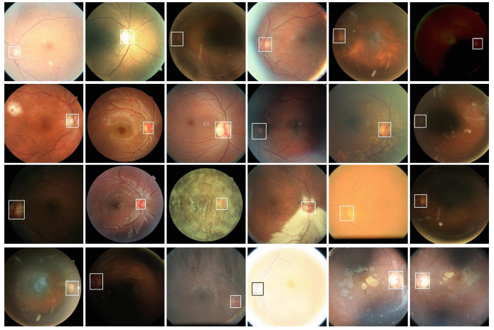

# Robust Optic Disc Localization by Large Scale Learning

By Shilu Jiang, Zhiyuan Chen, An an Li, and Yunhong Wang

## Introduction

The optic disc (OD) or optic nerve head (ONH) is the point of exit for ganglion cell axons leaving the eye. OD localization is not only a prerequisite for disc relevant disease screening, but also a necessary step for many other retinal image analysis tasks.

For more details, please refer to our [OMIA paper](https://link.springer.com/chapter/10.1007/978-3-030-32956-3_12).

**Limits:**
+ Simple handcrafted geometric models cannot deal with irregular variations of OD shape or the retinal vascular network; 
+ Existing models are trained on limited data, which makes them cannot deal with the low-quality images and rare cases; 
+ Current models are relatively simple for the task of locating OD in various kinds of images captured in less-controlled scenarios.

**Contributions:**
+ A large retinal dataset of 85,605 images covering various challenging cases is constructed; 
+ To facilitate the large dataset, an encoder-decoder network with deeper architecture and recursive mechanism is adopted to OD localization; 
+ Extensive experiments show the superior performance over state of the arts.



## Framework
We normalize the fundus image by fitting the circle and cropping the image.
Then the normalized image is fed to an encoder-decoder network with residual convolutional module, i.e., the hourglass net. 
Output of the network is a probability map of OD location from which we can get the final coordinates of estimated OD center. 
As for the final predicted location of OD center, we count the mean coordinate of all the pixels with the value greater than 70% of the maximum value in the output heat map.


## Result


**Evaluation Methodology :**

The accuracy of OD localization is measured by two kinds of methods. 

+ The predicted OD location is considered successful if it falls in the OD region. Depends on the annotation, the OD region can be rectangle bounding box, oval area or the manual fine contour/mask. 
+ Besides that radius-dependent accuracy is also adopted, in which 1/8, 1/4, 1/2 and one radius are investigated. 


### Table 1. Performance comparison based on morphologic regions (%).

|     Dataset     |      Method      |   Box   |   Oval  | Contour |    ED    | Time(ms) |
|:---------------:|:----------------:|:-------:|:-------:|:-------:|:--------:|:--------:|
| Messidor(1,200) | Sadhukhan et al. |    -    |    -    |  98.75  |    14    | **0.15** |
| Messidor(1,200) |        Lu        |    -    |    -    |  99.75  |     -    |   5000   |
|  Messidor(600)  |     Gu et al.    |    -    |    -    |  99.83  |     -    |     -    |
| Messidor(1,200) |     Yu et al.    |    -    |    -    |  99.67  |     -    |     -    |
| Messidor(1,200) |  Abdullah et al. |    -    |    -    |  99.25  |     -    |     -    |
| Messidor(1,200) | R. Kamble et al. |    -    |    -    |  99.75  |     -    |    520   |
| Messidor(1,200) |     Proposed     | **100** | **100** | **100** | **8.03** |     5    |
|    ARIA(120)    |        Lu        |    -    |    -    |   97.5  |     6    |   5000   |
|    ARIA(120)    |     Proposed     | **100** | **100** | **100** | **4.14** |   **5**  |
| EyePACS(51,806) |     Proposed     |   99.8  |  99.88  |    -    |   1.76   |     5    |

> Time of Giachetti et al. includes both OD and fovea detection.

### Table 2. Performance comparison of OD radius-dependent accuracies (%).

|     Dataset     |         Method        | 1/8 R |   1/4 R   |   1/2 R   |     R     | Time (ms) |
|:---------------:|:---------------------:|:-----:|:---------:|:---------:|:---------:|:---------:|
| Messidor(1,200) |    Al-Bander et al.   |   -   |    83.6   |     95    |     97    |     7     |
| Messidor(1,200) |    Giachetti et al.   |   -   |     -     |     -     |   99.66   |   *5000*  |
| Messidor(1,200) |       Yu et al.       |   -   |     -     |     -     |     99    |    4700   |
| Messidor(1,200) |       Yu et al.       |   -   |     -     |   99.08   |   98.24   |     -     |
| Messidor(1,200) |      Marin et al.     | 87.33 |   97.75   |   99.50   |   99.75   |     -     |
| Messidor(1,136) |      Meyer et al.     | 65.58 |   93.57   |   97.10   |   98.94   |     -     |
| Messidor(1,200) | Gegundez-Arias et al. | 80.42 |   93.92   |   96.08   |   96.92   |    940    |
| Messidor(1,200) |        Proposed       | 81.58 | **99.58** |  **100**  |  **100**  |   **5**   |
|    ARIA(120)    |        Proposed       | 60.00 |   97.50   |    100    |    100    |     5     |
|  EyePACS(3,000) |    Al-Bander et al.   |   -   |    51.9   |    87.4   |    96.7   |     7     |
| EyePACS(51,806) |        Proposed       | 84.47 | **99.42** | **99.82** | **99.89** |   **5**   |

## Citing 
Please cite our paper in your publications if it helps your research:

```tex
@inproceedings{jiang2019robust,
  title={Robust Optic Disc Localization by Large Scale Learning},
  author={Jiang, Shilu and Chen, Zhiyuan and Li, Annan and Wang, Yunhong},
  booktitle={International Workshop on Ophthalmic Medical Image Analysis},
  pages={95--103},
  year={2019},
  organization={Springer}
}
```

